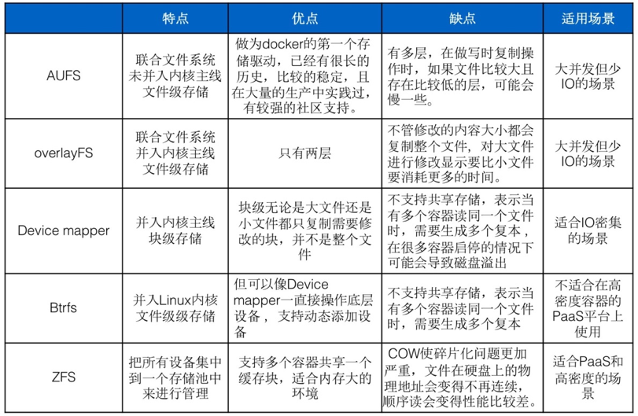
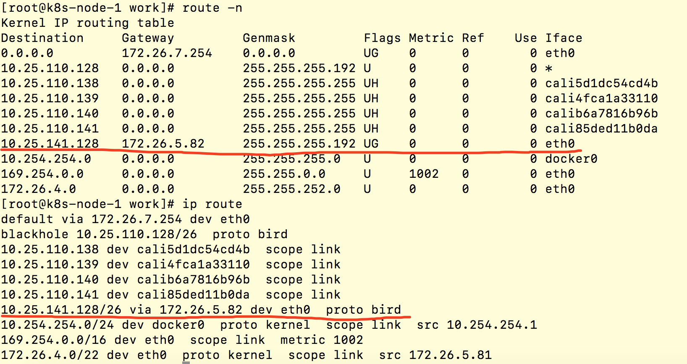
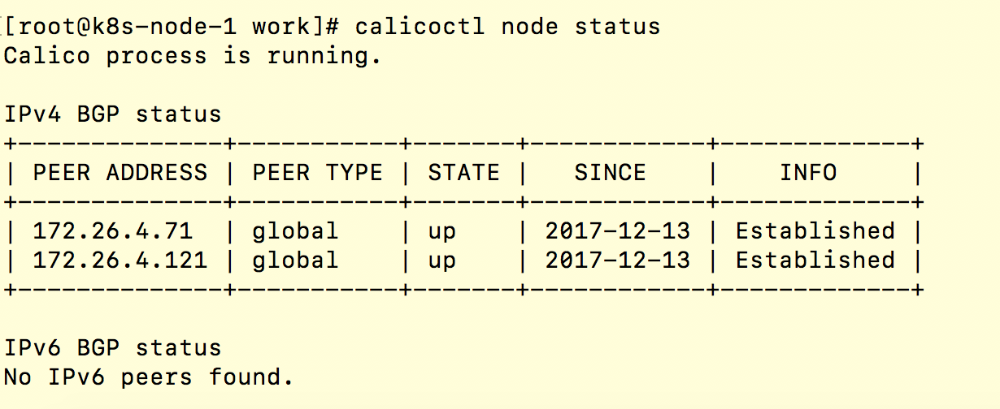

# easy-kube
Kubernetes install guide

Kubernetes v1.7.11

Docker v17.12.0-ce

CentOS 7.4 (3.10.0-693.11.1)

###【对环境选择的说明】

CentOS 7.4增加了对overlay存储驱动的支持，  

Docker 17.12-ce也同样完善了对overlay存储驱动的支持，  

为什么选择overlay存储驱动，因为在CentOS系统上常见的存储驱动有device mapper和overlay，在生产环境中大规模使用device mapper会有 “error initializing graphdriver: devmapper”、“device is busy”等错误，这是由于存储驱动的支持性问题造成的，所以在新版本中选用了官方更为推荐的overlay的方式，overlay存储驱动又有两个版本：overlay和overlay2，overlay版本在使用过程中有inode耗尽的问题，所以推荐使用overlay2。



参考链接：https://docs.docker.com/storage/storagedriver/select-storage-driver/  

Kubernetes版本根据自己业务情况选择即可，推荐使用1.6以上版本，rbac更完善一些，1.9版本把workload api升级到v1，后续变动肯定会更小，根据需求情况使用其稳定版本即可。  

Kubernetes集群的确是部署最复杂的集群之一，其难点又在于网络组件部分及其他各个组件的选型。

使用二进制方式用于生产环境的部署，已将所有二进制文件打包为rpm包，如下：

etcd-v3.2.11  
├── etcd  
│
└── etcdctl  
    ├── etcd.service  
    └── etcd.sh  
    
kube-master-v1.7.11  
├── kube-apiserver  
│
├── kube-controller-manager  
│
├── kube-scheduler  
│
└── kubectl  
    ├── kube-apiserver.service  
    ├── kube-controller-manager.service  
    ├── kube-scheduler.service  
    └── kube-master.sh  
    
kube-node-v1.7.11  
├── kubelet  
│
├── kube-proxy  
│
└──/opt/cni/bin/cni网络组件  
    ├── kubelet.service  
    ├── kube-proxy.service  
    └── kube-node.sh  


docker-ce v17.12  
└── docker-ce-17.12.0.ce-1.el7.centos.x86_64.rpm  

rpm包共享地址：  
链接:https://pan.baidu.com/s/1uoOTzN9B0_w_Yoe435iJcA  密码:i1nf  

### 第一步：初始化安装环境
很多人在安装过程中会遇到这样那样的安装问题，有不少是因为环境问题造成的，所以在安装前请先初始化安装环境，并请确认是否符合官方的版本要求。

当前环境为：CentOS Linux release 7.4.1708 (Core)  3.10.0-693.el7.x86_64

关闭firewall防火墙，禁用SELinux，初始化合适的yum源，设置hostname，设置ip forward转发，配置合适的内核参数等。

...

### 第二步：生成密钥证书
因为在新版本中组件都启用了https安全加密，所以需要生成所需的证书文件。

生成的 CA 证书和秘钥文件如下:

ca-key.pem  
ca.pem  
kubernetes-key.pem  
kubernetes.pem  
kube-proxy.pem  
kube-proxy-key.pem  
admin.pem  
admin-key.pem  

使用证书的组件如下:

etcd:使用 ca.pem、kubernetes-key.pem、kubernetes.pem;  
kube-apiserver:使用 ca.pem、kubernetes-key.pem、kubernetes.pem; kubelet:使用 ca.pem;  
kube-proxy:使用 ca.pem、kube-proxy-key.pem、kube-proxy.pem; kubectl:使用 ca.pem、admin-key.pem、admin.pem;  
kube-controller 、 kube-scheduler 当前需要和 kube-apiserver 部署在 同一台机器上且使用非安全端口通信，故不需要证书。
制作证书并分发到每个节点就可以了。

### 第三步：部署etcd集群
使用yum安装etcd即可，ansible脚本会自动将service文件中的变量替换，我们使用etcd_discovery_url集群自发现的方式启动，比较简单，注意，每个discovery_url只能使用一次，如果启动失败或更改启动参数，需要更换discovery_url，并且需要rm -rf /var/lib/etcd/ 将该目录下的数据清除。

我们使用的etcd https加密的方式启动，所以etcd节点也要有相应的证书文件。

discovery_url在此获取:  https://discovery.etcd.io/new?size=3


### 第四步：部署master节点
使用yum安装kube-master，service文件参数正确替换后，直接启动各种组件即可，使用kubectl get cs查看各组件状态，均为healthy表示部署成功。


...

### 第五步：生成kubeconfig文件
在master节点生成kubeconfig文件以供node节点使用，因为使用了RBAC的授权，所以需要定义各组件的权限，主要生成文件有：

bootstrap.kubeconfig ------ kubelet TLS bootstrap使用

kube-proxy.kubeconfig ------ kube-proxy使用

kubeconfig ------ admin权限，管理员远程操作使用

并且创建kubelet-bootstrap clusterrolebinding，否则kubelet会报未授权，api-server拒绝连接。


### 第六步：部署node节点
在node节点上使用yum安装docker-ce，我们这里使用了官方推荐的overlay2存储驱动启动，启动参数建议都放在/etc/docker/daemon.json文件里。

CentOS系统在/etc/docker/daemon.json文件里写入：
```
{
  "storage-driver": "overlay2",
  "storage-opts": [
    "overlay2.override_kernel_check=true"
  ]
}
```
devicemapper direct-lvm映射块方式启动：

docker-ce 17.06版本后，支持对lvm存储的自动管理。

初始化一块磁盘，fdisk格式化为linux lvm卷，pvcreate

在/etc/docker/daemon.json文件里写入：

```
{
  "storage-driver": "devicemapper",
  "storage-opts": [
  "dm.directlvm_device=/dev/vda5",
  "dm.thinp_percent=95",
  "dm.thinp_metapercent=1",
  "dm.thinp_autoextend_threshold=80",
  "dm.thinp_autoextend_percent=20",
  "dm.directlvm_device_force=true"
 ]
}
```
overlayfs是真正的分层存储，空间利用率高，基于文件的读写，效率高，device mapper是块设备存储，大量内容读写比较有优势。

docker存储驱动相关文档：https://docs.docker.com/engine/userguide/storagedriver/

设置iptables forward accept，docker 从 1.13 版本开始，将iptables 的filter 表的FORWARD 链的默认策略设置为DROP，从而导致 ping 其它 Node 上的 Pod IP 失败，因此必须在 filter 表的FORWARD 链增加一条默认允许规则 iptables -I FORWARD -s 0.0.0.0/0 -j ACCEPT

yum安装kube-node，确认参数配置正确及kubeconfig文件证书都存在后，启动kubelet和kube-proxy，此时，kubelet会向api-server发起加入集群的请求，我们在master节点上get csr可以看到该请求，使用approve来允许该节点加入集群，使用kubectl get node可以看到节点信息。


kubelet启动时需要与docker进程建立连接，所以kubelet强依赖于docker服务，kubelet与docker的cgroup driver要保持一致，cgroup驱动有cgroupfs和systemd，docker默认的是cgroupfs，k8s1.6版本后，默认驱动变为了cgroupfs，这里我们使用默认的cgroupfs。关于cgroup驱动，感兴趣的同学可以查看docker虚拟化原理，CGroup进程控制组。


### 第七步：部署集群网络
网络的部署是kubernetes集群的一个重点，此时的集群是没有网络组件的，可以看到node的状态是NotReady，容器的启动也只是以宿主机上docker默认的网络启动，只能通过docker0网桥进行单机的通信，calico、flannel都是容器领域比较成熟的网络方案，calico基于bgp协议进行路由交换。

我理解的网络，常用的有两种，一种是通过隧道封装的overlay网络，走tunnel 网卡与外部通信，常见的方式有flannel vxlan网络，calico ipip网络，另一种是实时监控的主机路由，走主机路由与外部通信，也叫underlay网络，由于少了ip头部的封装，性能也要比overlay网络要好一些，常见的有flannel vpc网络，calico bgp网络。

有些公有云环境不支持bgp对等，所以使用flannel vpc网络方案，私有云的自建机房，对网络及物理路由的可控性强，适合使用calico bgp网络。

calico bgp网络：
根据官方文档，我们以DaemonSet方式进行网络节点的部署

calico容器需要k8s的权限，我们在此先定义好各个组件的角色与权限，

https://docs.projectcalico.org/v2.6/getting-started/kubernetes/installation/rbac.yaml

https://docs.projectcalico.org/v2.6/getting-started/kubernetes/installation/hosted/calico.yaml

官方的calico ipip隧道网络是打开的，我们可以将其关掉，将上述文件的内容都填好，尤其是etcd的证书文件及挂载路径，calico节点的启动要与etcd进行通信获取路由信息，etcd是calico的存储数据库，之前遇到的几次问题都是由于证书挂载姿势不正确引起的。

etcd的证书我们以secret的方式进行挂载，yaml文件的secret创建会报错，我们以kubectl create secret的命令行方式进行创建。

kubectl apply -f calico.yaml，calico容器启动好后，我们可以看到在kube-system空间下启动了一个calico-kube-controllers和在每个节点上启动了calico-node容器，calico-kube-controllers是calico的主控节点，负责监控网络路由的变化和各个节点的工作后端，与etcd进行数据交互，calico-node是各个节点的网络守护进行，calico容器都是以host模式启动，此时你可以看到每个宿主机节点都开启了179的bgp协议端口，由calico后端bird进程启动，bird是网络路由的守护进程，calico核心组件felix对主机路由与iptables进行配置。

启动几个测试容器，可以看到在每个宿主机节点上新增了几条路由信息，这些是每个宿主机节点上的容器路由信息，同一节点容器的通信由这些路由直接转发，还有其他节点的路由信息，绑定到eth0网络走主机路由与外部网络通信。



bgp模式下是没有tunl0隧道网卡的，之前按官网配置开启了ipip模式，所有的外部路由信息都绑定到了tunl0网卡，即使将CALICO_IPV4POOL_IPIP参数设置为off也不行，折腾了半天，才发现是etcd中的ipip模式配置为on，下载calicoctl并配置与etcd连接，calicoctl是calico网络的配置管理工具，

calicoctl config get ipip 查看ipip模式工作状态
calicoctl config set ipip off 关闭ipip模式后重新部署便可以使用calico bgp网络
calico bgp网络的全互联模式默认是开启的，每一个宿主机节点都是一个vRouter，第一个节点都互相进行通信，交换路由信息，达到全互联，在小规模集群中还可以，当集群节点数量庞大时，超过100个节点，每一次的路由交换及刷新路由表的消耗都很高。
因此，我们启用Calico RouteReflector，将全互联模式关闭

calicoctl config set nodeToNodeMesh off
使用Calico RouteReflector与每个节点全局对等进行路由交换

创建两个路由反射器节点，下载calico/routeflector镜像，在使用官方的新版镜像时，不知道为什么，节点始终开启不了bgp的179端口，我们换一个镜像启动。

配置routeflector与etcd节点进行连接，配置证书信息，写入路由反射器的ip地址等信息，使用docker run的方式启动路由反射器。

配置路由反射器与calico节点全局对等，进行路由信息的交换，calictl node status 查看每个calico节点的状态，显示已连接成功，每个节点都与两个全局路由反射器对等。



此时容器网络已经可以互联，但仍然无法与外部的虚拟机网络进行通信，容器是可以ping通虚拟机的，但虚拟机无法ping通容器，因为虚拟机网络是不知道容器的网络信息的，我们把虚拟机网络的核心交换机配置与routeflector互联，此时，双方都知道对方的路由信息，便可以进行全连通的通信了。

flannel网络：
flannel网络的部署比较简单，一般是flannel vxlan的部署方式，通过flannel0隧道网卡进行ip封装通信，但略有带宽的损耗，这种部署方式直接使用flannel-vxlan.yaml文件进行创建即可。

flannel-vpc网络需要公有云网络的支持，以ali-vpc为例，使用flannel-vpc.yaml创建，此时宿主机节点不会创建flannel0这张网卡，每个节点的网段信息都写入了vpc网络的路由表中（需要vpc网络的secret权限），容器通过vpc路由表直接进行路由转发，几乎没有性能损耗。


NetworkPolicy：
Calico支持Kubernetes API的NetworkPolicy，NetworkPolicy可以设置容器间的网络隔离，限制应用间的访问，如各个环境的隔离等，通过label的方式进行选择限制，可以精确到namespace，cidr网段，容器pod，ip地址，端口号等

### 第八步：部署Heapster+Influxdb+Grafana监控
Heapster+Influxdb+Grafana是一套现代化的监控体系，Heapster是kubernetes官方默认的监控组件，Heapster是一个数据收集者，kubelet在每个node节点上都启动了一个cAdvisor进程，cAdvisor负责收集各个节点上的容器资源信息，并在每个节点上监听4194端口。

数据收集流程如下：

cAdvisor(监控容器资源)-->Heapster(收集cAdvisor监控数据)-->Influxdb(时序数据库，保存数据)→Grafana(监控展示面板)
所以Heapster需要访问kube-api的权限，需要创建rbac角色用于认证，Influxdb默认保存数据30天

参考链接：https://github.com/gjmzj/kubeasz/blob/master/docs/guide/heapster.md

......

### 第九步：部署kube-dns kube-dashboard等组件
kube-dns，将yaml模板里的文件CLUSTER_DNS_SVC_IP, CLUSTER_DNS_DOMAIN变量替换，默认使用：

CLUSTER_DNS_SVC_IP: 10.254.0.2

CLUSTER_DNS_DOMAIN: cluster.local.

kube-dns是service服务发现的插件，默认会在容器的nameserver文件（/etc/resolv.conf）里加入dns服务器地址：

nameserver 10.254.0.2

search default.svc.cluster.local. svc.cluster.local. cluster.local.

容器便会使用宿主机的dns服务器解析来访问网络。

参考链接：https://github.com/gjmzj/kubeasz/blob/master/docs/guide/kubedns.md

......

### 第十步：部署Prometheus监控组件
Prometheus监控的部署稍后上传......

### 第十一步：部署coredns、ingress等组件
相关组件部署文档已放入addones目录下，相关gcr.io的镜像将上传至registry.cn-north-1.huaweicloud.com地址上。
使用时注意修改相关的路径配置

### 第十二步：部署EFK日志收集组件
......

......


